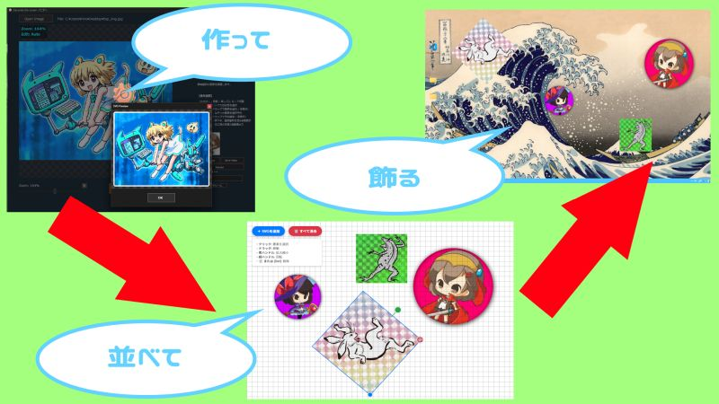
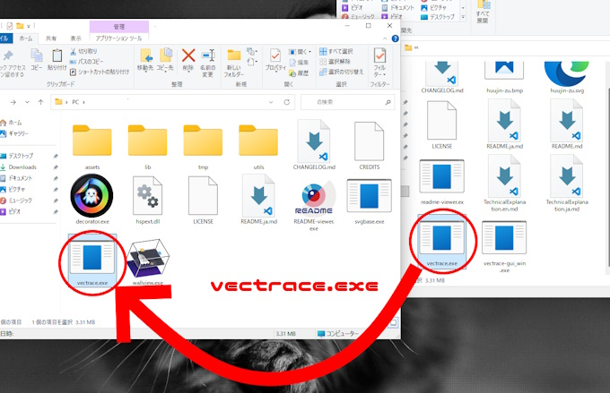
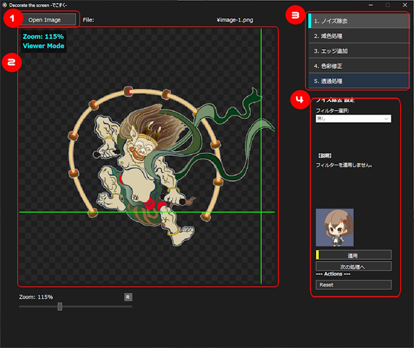
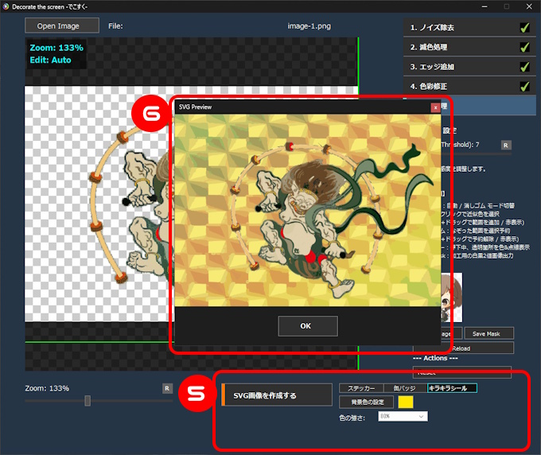
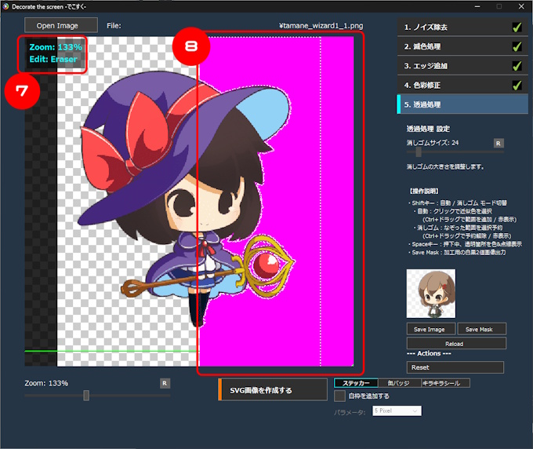
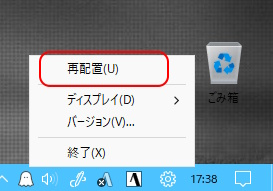
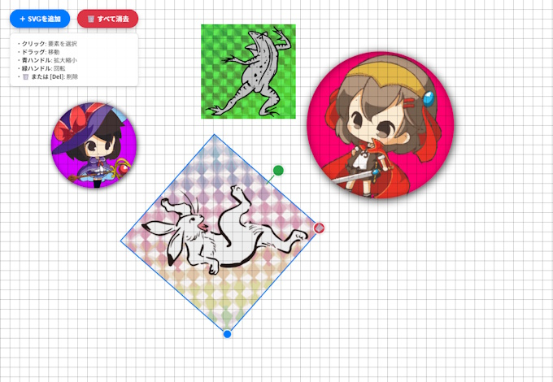
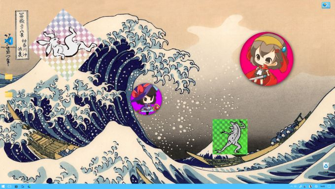
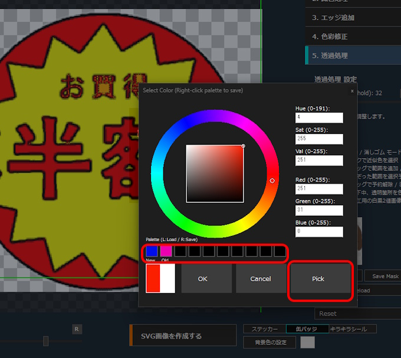

🌐 [English](./README.md) | **日本語**

# Decorate the screen -でこすく-



## 概要

- `Decorate the screen -でこすく-` は、好きなイラストや写真をスッテカー風のSVG形式に変換し、自由にデスクトップを飾るためのアプリケーションです。飾ると壁紙にステッカーを貼った感じになり、デスクトップのアイコン操作等の妨げにはなりません。
- 使用には別途、 ビットマップ トレース ツール [Vectrace](https://www.vector.co.jp/soft/winnt/art/se529086.html)というアプリが必要となります。書庫を解凍して得られた`vectrace.exe`を`decorator.exe`と同じフォルダに配置してください。
- バイラテラルフィルターやk-means法（k平均法）等の高度な画像処理アルゴリズムを搭載しており、高品質なノイズ除去や減色処理を実現します。
- 本アプリは2つのツールで構成されています。
  - `decorator.exe`: スッテカー風な画像を作成するためのツールです。
  - `wallview.exe`: デスクトップの壁紙を監視し、描画領域を管理するバックグラウンド常駐プログラムです。

## 動作環境

| 項目 | 内容 |
| --- | --- |
| 対応OS | Windows 10 / 11 |
| アーキテクチャ | 32bitアプリ（64bit Windowsでも動作可能） |
| 必須ソフトウェア | Microsoft Edge（SVG表示に WebView2 Runtime を使用） |
| 外部ツール | [Vectrace](https://www.vector.co.jp/soft/winnt/art/se529086.html)（ビットマップトレースツール） |
| 推奨入力画像サイズ | 680×680 ピクセル以下 |

## インストール方法

1. 配布アーカイブを任意のフォルダに解凍します。
2. [Vectrace](https://www.vector.co.jp/soft/winnt/art/se529086.html) を別途ダウンロードし、書庫を解凍して得られた `vectrace.exe` を `decorator.exe` と同じフォルダに配置してください。
   - [Vector](https://www.vector.co.jp/soft/winnt/art/se529086.html) または [GitHub](https://github.com/nyorotan/vectrace) からダウンロードできます。
3. Microsoft Edge がインストールされていることを確認してください（通常、Windows 10/11 にはプリインストールされています）。
4. `decorator.exe`（ステッカー作成）または `wallview.exe`（壁紙にステッカーを飾る）を起動します。



## フォルダ構成

```
Decorate/
├── assets/                 ... サンプル画像・アイコン・カーソル等のリソース
├── lib/                    ... Go言語製DLL（画像処理・減色処理）
│   ├── image_tool_x86.dll
│   └── reduction_x86.dll
├── tmp/                    ... 一時ファイル（自動生成・自動削除）
├── utils/                  ... 設定ファイル
│   ├── color_palette.json  ... カラーパレット保存データ
│   ├── autosave.json       ... 配置情報の自動保存ファイル
│   └── exported_image.png  ... 壁紙合成用のエクスポート画像
├── decorator.exe           ... ステッカー作成ツール（メインツール）
├── svgbase.exe             ... SVG配置エディタ（WebView2ベース）
├── wallview.exe            ... 壁紙監視・描画ツール
├── vectrace.exe            ... ビットマップトレースツール（別途入手）
├── hspext.dll              ... HSP拡張プラグイン
├── LICENSE                 ... MIT License ファイル
├── CREDITS                 ... 各種ライブラリ等のライセンスファイル
├── CHANGELOG.md            ... 更新履歴
├── README.md               ... 取扱説明書、このファイルです
└── README-viewer.exe       ... README.md専用のビューワ。
```

 ※`README-viewer.exe` は、作者の別プロジェクトであり、単体でも動作するフリーソフトとして [Vector](https://www.vector.co.jp/soft/winnt/util/se529125.html) 及び [GitHub](https://github.com/nyorotan/readme-viewer) で公開しています。

## 注意点

### アプリの制限

- ラスタ・ベクタ変換（ビットマップ画像からSVG画像への変換）は`ピクセル（点の集合）`でできたラスターデータを、座標や数式で構成される`ベクターデータ（線や面）`に変換しています。そのため`原理的な限界`があり、`全く同じ画像にすることは不可能`です。また、複雑な画像や色数の多い画像には向いていません。その点は留意しておいて下さい。

- HSP3が32bitアプリのため、使用しているDLLも32bitとなり、64bit環境で動作していても扱えるメモリ量などに制限があります。特に巨大な画像や複雑すぎるパスを含むSVGファイルを読み込む際は、動作が不安定になったり、メモリ不足でエラーが発生したりする可能性があるためご注意ください。`入力に使用する画像ファイルのサイズは680x680までを推奨します。`
- SVG画像の表示に `WebView2` を使用しています。 `Microsoft Edge` がインストールされていれば問題ありません。
- 画像処理の時間は画像サイズや設定したアルゴリズムの複雑さに依存します。特にバイアテラルフィルターやk-means法（k平均法）を使用する場合、処理に時間がかかります。
- 本アプリはデスクトップの描画レイヤーを操作します。他のデスクトップカスタマイズツールと競合する可能性があるため、併用にはご注意ください。

### Vectrace について

Vectrace はカラービットマップ画像をSVG画像に変換するためにGo言語で作成したコマンドラインツールです。  
ライセンスの関係上、本アプリには同梱できないので外部サイトからのダウンロードが必要になります。[こちら](https://www.vector.co.jp/soft/winnt/art/se529086.html)と[こちら](https://github.com/nyorotan/vectrace)で公開しています。

### SVG画像とは

SVGは「Scalable Vector Graphics」の略で、拡大しても画像が荒れない「ベクター形式」の画像です。  
本ツールでは、加工した画像をSVG形式に変換することで、解像度に依存しないグラフィックとして利用できるようにします。

## 特徴

- 作業は難しそうに見えますが、プレビュー画面で確認しながら順番にフィルターを選んでいくだけの簡単操作です。
- 本アプリは主に `HSP3` で記述されていますが、フィルター等の一部の処理は `GO言語` で記述したDLLやexeによって高速化しています。
- ステッカー風SVG画像（以下、ステッカーとする）の作成には5つのセクションがあり、それぞれのセクションで以下のフィルター処理を行います。

  - `ノイズ除去`: 写真のノイズを低減し、滑らかな質感にします。
  - `減色処理`: 色数を絞り込み、イラストやポスタリゼーションのような独特な表現にします。
  - `エッジ追加`: 画像の輪郭を検出し、線画のように強調します。
  - `色調整`: 彩度を調整して、色の鮮やかさを変化させます。
  - `透過処理`: 指定された背景色や特定の色の領域を透明化し、背景を透過させます。

- PCへの負荷を考慮して、実際にSVG画像を飾るのではなく、壁紙と合成されたPNG画像を飾ることで、低スペックな環境でも快適に動作するように設計されています。

- 飾る画像は`壁紙とアイコン（デスクトップ）の間`に挿入され、他の作業の妨げにはなりません。

- 複数のモニターがある場合はモニターを選んで飾ることが可能です。

## 使い方

### 1. 作る

#### `decorator.exe` を起動



①. 「Open Image」ボタンから加工したい画像を選択します。`画像ファイルのサイズは680x680までを推奨します。`  
②. 「プレビューウインドウ」で読み込んだ画像を確認しながら、各種フィルターを適用していきます。マウススクロールで拡大/縮小、右ドラッグで画像を移動、センタークリックで初期表示に戻ります。  
③. 5つのセクションを順番に実行していきます。完了したセクションにはチェックマークが付きます。  
④. 各セクションで実行するフィルターを選択します。`適用できるフィルターは一つのセクションにつき一つだけ`です。重ねがけはできません。

- フィルターによっては設定可能なパラメーターが表示されます。
- 小窓の画像はフィルターのサンプル画像です。
- 「適用」を押すとフィルター処理された画像がプレビュー画面に表示されます。気に入った画像になるまでこの作業を繰り返します。
- フィルターを適用して「次の処理へ」を押すと次のセクションに進みます。



⑤. 作成するステッカーは3種類の中から選ぶことが出来ます。

- `ステッカー`: プレビュー画像をそのまま変換します。白枠を持たせて、よりステッカー風にすることも可能です。
- `缶バッジ`: 缶バッジ風の丸い形なステッカーを作成します。背景色を選ぶことが出来ます。
- `キラキラシール`: 背景をキラキラシール風な画像にします。シールの色とその色の強さを選ぶことが出来ます。

⑥. スッテッカーが完成すると、別窓が開き表示されます。このウインドウでもマウスによる拡大/縮小等の操作が可能です。

#### 透過処理での操作方法



透過処理では Shiftキーで `自動 / 消しゴム モード`を切替、Ctrlキーで `効果` を切替えて背景を透過していきます。

- 自動：クリックで近似色を選択 / 緑表示 `(Ctrl+ドラッグで範囲を追加 / 赤表示)`
- 消しゴム：ドラッグでなぞった部分を消去 / 緑表示  `(Ctrl+ドラッグで範囲を復元 / 赤表示)`

⑦. 透過処理はプレビューウインドウが「Edit」モードになります。更に「自動」か「消しゴム」かが表示されます

⑧. Spaceキーを押下中は、透明箇所がマゼンタ色&境界線が点線表示されます。  

「Save Image」でプレビューウインドウの画像をPNG形式で保存できます。透過情報（アルファチャンネル）も保持されます。  
「Save Mask」でプレビューウインドウを加工用の白黒2値画像として保存できます。他のアプリで等で使用したいときにご利用ください。

### 2. 並べる

#### `wallview.exe` を起動



- `wallview.exe` を起動したら、タスクトレイのアイコンを右クリックして、メニューから「再配置」を選択します。



- 先ほど作成したステッカーを読み込み、自由に配置して下さい。SVG画像形式であれば他のアプリで作成した`ステッカーも読み込むことが可能です。`
- 編集完了後、右上にカーソルを移動させると表示される「×」ボタンかタスクトレイのメニューの「終了」を押してウィンドウを閉じると自動的に内容が保存され、デスクトップ壁紙上に反映されます。
- 自動保存とは別に、タスクトレイのメニューから手動で今の状態を`Jsonファイル`として別の場所に保存可能です。同じくメニューから読み込んで復元することができます。

## 3. 飾る



`wallview.exe` を起動させると、自動保存された状態が読み込まれます。  
複数のモニターがある場合は、タスクトレイのメニューからモニターを選んで表示させることができます。  
Windowsの壁紙設定を変更すると、WallViewは自動的に新しい壁紙を検知し、再描画を行います。

## 各セクションの詳細説明

### 1. ノイズ除去

- `平均化`: 周囲の画素を平均化することで、ざらつきを抑えます。
- `ガウス`: ガウス関数を用いて、自然なぼかしでノイズを除去します。
- `バイラテラル`: エッジを保持したまま平滑化を行い、ノイズを低減します。
  > **計算量が多いため、他のフィルターより処理に時間がかかります。また、非常に大きなメモリーを消費します。**
- `桑原`: エッジを保持しつつ領域内を平滑化し、絵画風の効果を与えます。

「バイラテアル」が一番綺麗に仕上がりますが、結構時間がかかってしまうので「桑原」を軽く適用でもいいかと思います。

### 2. 減色処理

**このセクションは必須であり、「無し」を選択することはできません。**

- `メディアンカット`: 代表的な色を効率よく選出し、バランスの良い減色を行います。
- `k-means`: 統計的なクラスタリングにより最適な色を計算します。
  >**そこそこ時間が掛かります。サンプリング間隔を広くとることで劇的に速度が上がりますが、精度が落ちます。ランダム要素があるため計算のたびに違う結果が出ます。**
- `ポスタリゼーション`: 階調数を強制的に制限し、イラストのような平坦な表現にします。

一般的に多く用いられているのが「メディアンカット」です。  
「k-means」は適用するたびに結果が変わってきます。  
処理の安定性を求める場合は「メディアンカット」を、より高品質で最適化された色配置を求める場合は「k-means」を選択するのがおすすめです。

### 3. エッジ追加

**サンプル画像は分りやすく白黒になっていますが、実際は内部処理で元画像から白黒画像を減算してエッジを強調します。**

- `ソーベル`: 輝度の勾配を計算し、輪郭を抽出します。
- `ラプラシアン`: 二次微分を用いて、急激な変化がある箇所を抽出します。
- `Canny`: 境界を細線化し、ノイズに強い鮮明なエッジを抽出します。
- `アンシャープマスク`: ガウスぼかしの差分を利用して、輪郭を強調し鮮明にします。
  > 「ガウスぼかし」の結果を転用するため、白黒画像は作られません。

ほとんどの場合、このセクションは「無し」でいいかと思います。  
写真をイラスト風や絵画風にしたい場合に使うと良いでしょう。

### 4. 色彩修正

減色等で彩度が落ちて暗くなってしまったときに、お好みで。

### 5. 透過処理

「自動」で大まかに削除し、「消しゴム」で細かい部分を。  
失敗して消しすぎてしまった場合は **「消しゴム」 + Ctrlキー押下中** はカーソルが赤くなり、なぞった部分を元に戻せますので活用して下さい。

## カラーピッカーについて



色を選択する場面では `カラーピッカー` を使用することになります。

- **パレット機能:** よく使う色を最大10個まで保存・読み込み可能。
  - **色の保存:** パレット上の枠を**右クリック**すると、現在選択中の色が保存されます。
  - **色の読み込み:** パレット上の枠を**左クリック**すると、保存された色が反映されます。

- **スポイト機能:** モニター画面上の任意の場所から色を抽出可能。
    1. 「Pick」ボタンをクリックします。
    2. カーソルが十字線に変わり、マウス位置の色がリアルタイムでプレビューされます。
    3. 取得したい場所で**左クリック**すると、その色がピッカーに反映されます。
    4. キャンセルしたい場合は `Esc` キーを押してください。

## キーボード・マウス操作一覧

### プレビューウインドウ（decorator.exe）

| 操作 | 動作 |
|---|---|
| マウススクロール | 拡大 / 縮小 |
| 右ドラッグ | 画像を移動 |
| センタークリック（ホイールクリック） | 初期表示に戻す |

### 透過処理モード

| 操作 | 動作 |
| --- | --- |
| Shiftキー | 自動 / 消しゴム モード切替 |
| Ctrlキー押下中 | 効果の切替（追加⇔削除 / 削除⇔復元） |
| Spaceキー押下中 | 透明箇所をマゼンタ色 & 境界線を点線で表示 |

#### 自動モード

| 操作 | 動作 | 表示色 |
| --- | --- | --- |
| 左クリック | 近似色を選択して透過 | 緑 |
| Ctrl + ドラッグ | 範囲を追加 | 赤 |

#### 消しゴムモード

| 操作 | 動作 | 表示色 |
| --- | --- | --- |
| ドラッグ | なぞった部分を消去 | 緑 |
| Ctrl + ドラッグ | なぞった部分を復元 | 赤 |

## データの保存と復元

### decorator.exe での保存

- **Save Image**: プレビューウインドウの画像をPNG形式で保存できます。透過情報（アルファチャンネル）も保持されます。
- **Save Mask**: プレビューウインドウの画像を白黒2値画像として保存できます。他のアプリで使用したい場合にご利用ください。

### wallview.exe での保存と復元

- **自動保存**: 配置エディタを閉じると、現在の配置情報が `wallview/utils/autosave.json` に自動保存されます。次回起動時に自動的に読み込まれます。
- **手動保存**: タスクトレイのメニューから、現在の配置状態をJSONファイルとして任意の場所に保存できます。
- **復元**: タスクトレイのメニューから、保存したJSONファイルを読み込んで配置を復元できます。

## トラブルシューティング

| 症状 | 原因と対処法 |
| --- | --- |
| Vectraceが見つからないと表示される | `vectrace.exe` が `decorator.exe` と同じフォルダに配置されていません。[Vectrace](https://www.vector.co.jp/soft/winnt/art/se529086.html) をダウンロードして配置してください。 |
| 処理が非常に遅い | バイラテラルフィルターやk-meansは計算量が多いため時間がかかります。画像サイズを小さくするか、「桑原」や「メディアンカット」など軽量なフィルターをお試しください。 |
| メモリ不足エラーが発生する | 32bitアプリのため使用可能メモリに制限があります。入力画像を680×680ピクセル以下に縮小してください。 |
| SVG画像が表示されない | Microsoft Edge（WebView2 Runtime）がインストールされているか確認してください。 |
| 壁紙にステッカーが反映されない | `wallview.exe` が起動しているか確認してください。タスクトレイにアイコンが表示されているか確認してください。 |
| 壁紙を変更してもステッカーが消える | `wallview.exe` が起動中であれば、壁紙変更を自動検知して再描画します。数秒のタイムラグが発生する場合があります。 |
| 他のデスクトップカスタマイズツールと競合する | 本アプリはデスクトップの描画レイヤーを操作するため、他のツールとの併用にはご注意ください。 |

## 技術情報

本アプリは複数の言語と技術を組み合わせて構成されています。

| コンポーネント | 使用技術 | 説明 |
| --- | --- | --- |
| decorator.exe | HSP3 | メインUIとワークフロー制御 |
| wallview.exe | HSP3 | 壁紙監視とタスクトレイ常駐 |
| svgbase.exe | Go + WebView2 | SVG配置エディタ（HTML/CSS/JS） |
| image_tool_x86.dll | Go (cgo) | 画像プレビュー・透過処理・SVG表示 |
| reduction_x86.dll | Go (cgo) | ノイズ除去・減色・エッジ検出・色彩修正 |
| vectrace.exe | Go | ビットマップからSVGへの変換（外部ツール） |

## ライセンス

本プロジェクトは`MITライセンス`の元で公開されています。商用・非商用問わず自由にご利用ください。

- **著作権**: © 2026 nyorotan
- **Vectrace**: ライセンスの関係上、本アプリには同梱していません。[Vector](https://www.vector.co.jp/soft/winnt/art/se529086.html) または [GitHub](https://github.com/nyorotan/vectrace) から別途入手してください。

## バージョン情報

- **バージョン**: v1.0.2
- **作者**: nyorotan
